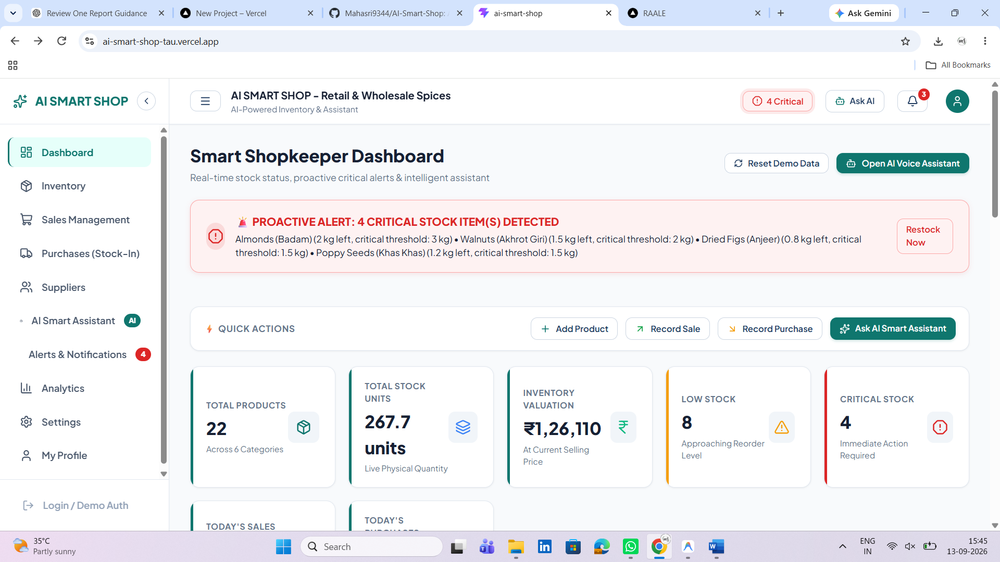
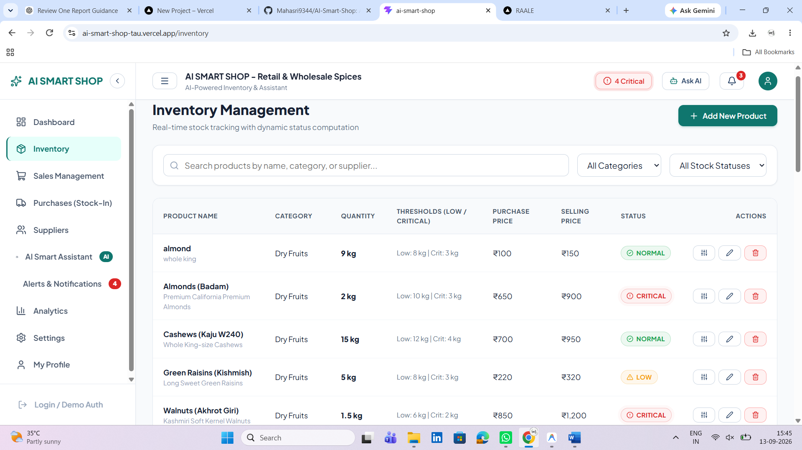
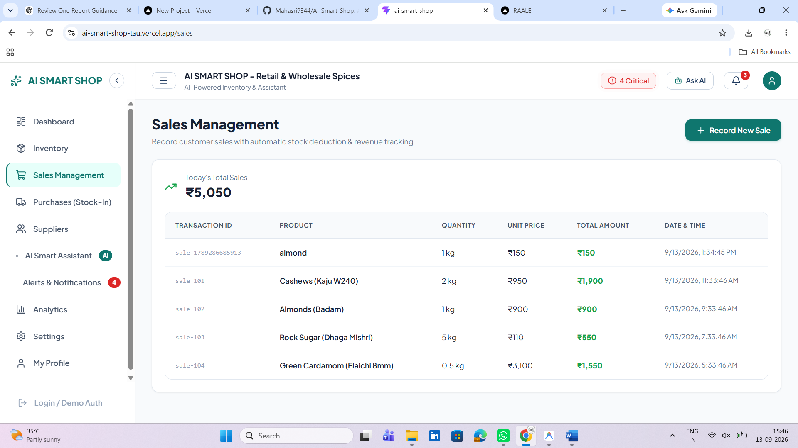
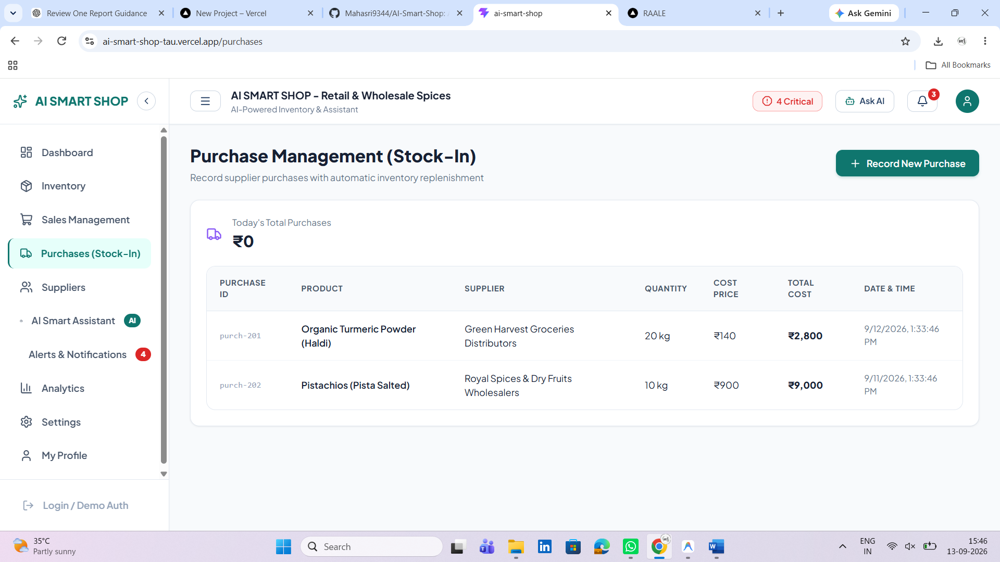
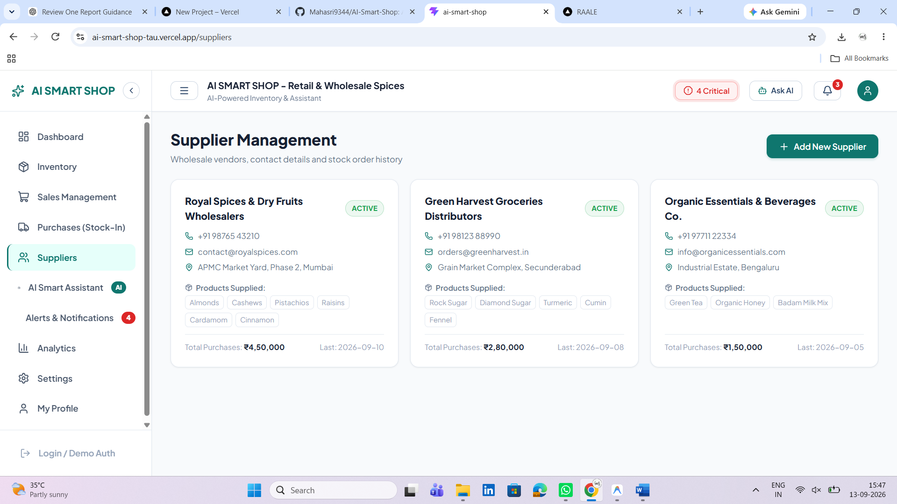
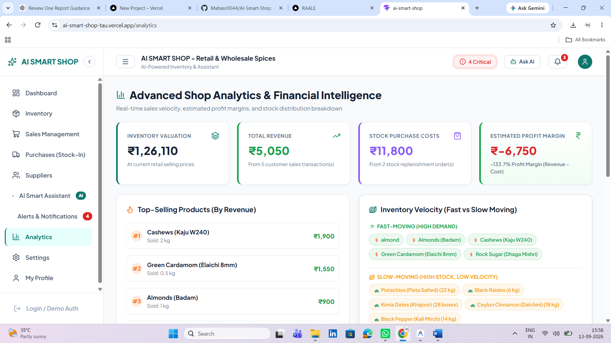
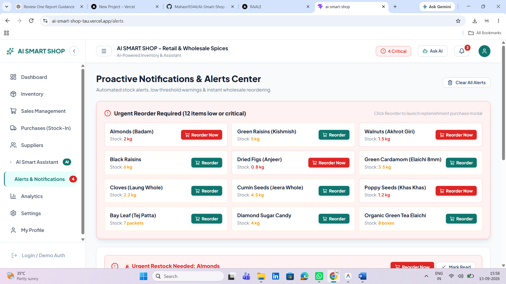
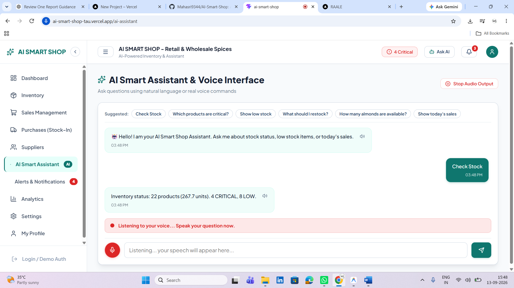

# 🛒 AI SMART SHOP
> **AI-Powered Intelligent Inventory & Shop Assistant**

[](https://github.com/Mahasri9344/AI-Smart-Shop)
[](https://react.dev/)
[](https://www.typescriptlang.org/)
[](https://vitejs.dev/)
[](#-prototype-disclaimer--academic-note)
[](https://github.com/Mahasri9344/AI-Smart-Shop)

**AI Smart Shop** is a modern, commercial-grade intelligent shop management platform built for small and medium retail businesses. It bridges the gap between traditional inventory tracking systems and modern artificial intelligence by combining **proactive critical stock alerts**, **natural-language inventory queries**, **voice command interactions with speech synthesis**, and **real-time dynamic stock intelligence**.

---

## 📌 Problem Statement

Conventional retail shop and inventory management software presents major operational challenges for shopkeepers:
1. **Lack of Proactive Critical Stock Alerts**: Shopkeepers are often unaware when stock reaches critical threshold levels until an item is completely depleted, leading to unfulfilled orders and lost customer revenue.
2. **Complex Multi-Screen Navigation Friction**: Routine shop tasks—such as checking low stock, recording daily sales, or identifying vendor reorder quantities—require navigating through crowded tabular screens and complex menus.
3. **Accessibility & Typing Barriers**: Workers or shopkeepers who are uncomfortable with complex desktop software or quick typing face friction and operational delays during peak business hours.

---

## 🎯 Project Objectives

- **Unified SaaS Dashboard**: Deliver a clean, accessible web dashboard tailored for non-technical retail shop owners.
- **Dynamic Stock Calculation**: Dynamically compute stock status (`NORMAL`, `LOW`, `CRITICAL`) using mathematical threshold evaluations.
- **Proactive Notifications**: Automatically generate urgent alerts when stock crosses critical thresholds, synchronized with top header notification badge counters.
- **Hands-Free AI Voice Assistant**: Enable voice-based inventory queries and audio responses using the Web Speech API (`SpeechRecognition` & `SpeechSynthesis`).
- **Synchronized Sales & Purchases**: Automatically deduct stock on sales entry (with oversell protection guards) and increment stock on purchase order replenishment.
- **Financial & Inventory Analytics**: Calculate inventory valuation, sales revenue, purchase expenses, estimated profit margins, top-selling items, and fast/slow-moving goods velocity.

---

## 💡 Key Features & Modules

### 1. 📊 Smart SaaS Dashboard ([Dashboard.tsx](file:///c:/Users/user/Documents/AI-Smart-Shop/src/pages/Dashboard.tsx))
- **Live KPI Summary**: Real-time metric cards displaying Total Products, Total Stock Units, Inventory Valuation, Low Stock Count, Critical Stock Count, Today's Sales Revenue, and Today's Purchase Costs.
- **Proactive Critical Alert Banner**: Automatically renders prominent warnings when critical stock items are detected in the system.
- **Quick Action Triggers**: Modal launchers for `+ Add Product`, `+ Record Sale`, `+ Record Purchase`, and `🤖 Ask AI`.
- **Activity & Stock Warning Lists**: Quick glance tables showing urgent stock items and recent inventory transactions.

### 2. 📦 Inventory Management ([Inventory.tsx](file:///c:/Users/user/Documents/AI-Smart-Shop/src/pages/Inventory.tsx))
- Real-time catalog management with search, category filtering, and status filtering (`NORMAL`, `LOW`, `CRITICAL`).
- **ProductModal**: Create or update products with custom low stock thresholds, critical stock thresholds, and assigned supplier mappings.
- **StockAdjustModal**: Instant single-click stock quantity adjustments (`+` / `-`).

### 3. 💳 Sales Management ([Sales.tsx](file:///c:/Users/user/Documents/AI-Smart-Shop/src/pages/Sales.tsx))
- **RecordSaleModal**: Log customer billing orders with instant inventory stock deduction.
- **Stock Validation Guard**: Prevents selling greater quantities than currently available in stock.

### 4. 🚚 Purchase Management ([Purchases.tsx](file:///c:/Users/user/Documents/AI-Smart-Shop/src/pages/Purchases.tsx))
- **RecordPurchaseModal**: Record wholesale replenishment orders with automatic stock incrementing.

### 5. 🤝 Supplier Directory ([Suppliers.tsx](file:///c:/Users/user/Documents/AI-Smart-Shop/src/pages/Suppliers.tsx))
- **SupplierModal**: Manage wholesale vendors, phone numbers, email addresses, physical locations, and mapped product catalogs.

### 6. 🤖 AI Smart Assistant & Voice Interface ([AIAssistant.tsx](file:///c:/Users/user/Documents/AI-Smart-Shop/src/pages/AIAssistant.tsx))
- **Web Speech API Integration**: Real-time microphone voice input (`SpeechRecognition`) and natural spoken audio response synthesis (`SpeechSynthesis`).
- **Natural-Language NLP Engine** ([aiService.ts](file:///c:/Users/user/Documents/AI-Smart-Shop/src/services/aiService.ts)): Answers dynamic shop questions without hardcoded responses, such as:
  - *"Which products are critical?"*
  - *"What should I restock?"*
  - *"Show today's sales"*
  - *"How many almonds are available?"*

### 7. 🚨 Proactive Alerts & Notification Center ([Alerts.tsx](file:///c:/Users/user/Documents/AI-Smart-Shop/src/pages/Alerts.tsx))
- Centralized alert logs for critical and low stock events, synchronized with top header badge notification counters. Mark notifications as read or dismiss them with a single click.

### 8. 📈 Analytics & Financial Intelligence ([Analytics.tsx](file:///c:/Users/user/Documents/AI-Smart-Shop/src/pages/Analytics.tsx))
- **Financial Overview**: Inventory Valuation, Gross Sales Revenue, Purchase Costs, and Estimated Profit Margins (`Revenue - Purchase Costs`).
- **Inventory Velocity**: Categorizes products into fast-moving vs. slow-moving stock based on sales transaction volume.
- **Top-Selling Ranking**: Ranked lists of best-performing store items by revenue.
- **Category Valuation Breakdown**: Relative visual distribution bars across categories.

### 9. 🎨 Responsive SaaS UI & Design System ([index.css](file:///c:/Users/user/Documents/AI-Smart-Shop/src/index.css))
- **Vanilla CSS Design Tokens**: Custom HSL color variables, dark/light theme tokens, subtle glassmorphism cards, and smooth CSS transitions.
- **Responsive Layout**: Sidebar drawer navigation, header search bar, critical stock indicator badges, and mobile-friendly layouts.

### 10. 🔐 User Authentication & Settings ([Login.tsx](file:///c:/Users/user/Documents/AI-Smart-Shop/src/pages/Login.tsx), [Settings.tsx](file:///c:/Users/user/Documents/AI-Smart-Shop/src/pages/Settings.tsx))
- User authentication screens (Login & Signup), profile configuration, theme toggle controls, and notification preferences.

---

## 🏗️ System Architecture Diagram

```
                               ┌────────────────────────────────────────┐
                               │           UI / View Layer              │
                               │ React 19 Components, SaaS Shell        │
                               └───────────────────┬────────────────────┘
                                                   │
                ┌──────────────────────────────────┼──────────────────────────────────┐
                │                                  │                                  │
    ┌───────────▼───────────┐          ┌───────────▼───────────┐          ┌───────────▼───────────┐
    │     AI Engine         │          │    Data & Stock Service│          │     Voice Engine      │
    │ - Intent Recognizer   │◄─────────┤ - Realtime Inventory  │─────────►│ - Speech Recognition  │
    │ - Dynamic Query Engine│          │ - Dynamic Stock Status│          │ - Text-to-Speech (TTS)│
    │ - Natural Answers     │          │ - Sales & Purchases   │          │ - Speech State Sync   │
    └───────────────────────┘          └───────────┬───────────┘          └───────────────────────┘
                                                   │
                                       ┌───────────▼───────────┐
                                       │ Storage / Persistence │
                                       │ LocalStorage Store /  │
                                       │ DataService Adapter   │
                                       └───────────────────────┘
```

---

## 🔄 Data Flow Diagram

```
[User Action / Voice Command / Sales Entry]
                │
                ▼
      ┌──────────────────┐
      │  React View / UI │
      └─────────┬────────┘
                │
                ▼
      ┌──────────────────┐      ┌───────────────────────────┐
      │   ShopContext    ├─────►│ stockIntelligence Engine  │
      └─────────┬────────┘      │ - Calculate NORMAL / LOW /│
                │               │   CRITICAL Stock Status   │
                │               └─────────────┬─────────────┘
                │                             │
                ▼                             ▼
      ┌──────────────────┐      ┌───────────────────────────┐
      │   DataService    │      │  Proactive Alert Trigger  │
      │  (LocalStorage)  │      │ - Create NotificationItem │
      └──────────────────┘      └───────────────────────────┘
```

---

## 📐 Dynamic Stock Calculation Formula

Stock status is dynamically evaluated per item using mathematical threshold boundaries:

$$\text{Status} = \begin{cases} \text{CRITICAL} & \text{if } \text{quantity} \le \text{criticalStockThreshold} \\ \text{LOW} & \text{if } \text{criticalStockThreshold} < \text{quantity} \le \text{lowStockThreshold} \\ \text{NORMAL} & \text{if } \text{quantity} > \text{lowStockThreshold} \end{cases}$$

---

## 🛠️ Technology Stack

| Layer | Technology | Details |
| :--- | :--- | :--- |
| **Frontend Framework** | React 19.0 + TypeScript 6.0 | Modern declarative component architecture |
| **Build Tool & Server** | Vite 8.3 | Lightning-fast HMR and production bundle optimization |
| **Routing** | React Router v7.18 | Single-page application nested layout routing |
| **Styling & UI** | Vanilla CSS3 | Custom HSL design tokens, CSS Flexbox/Grid, Glassmorphism |
| **Iconography** | Lucide React | Clean commercial icon set |
| **State & Persistence** | React `ShopContext` + `DataService` | Reactive state provider with `LocalStorage` seed persistence |
| **Voice & Audio** | Web Speech API | Native browser `SpeechRecognition` & `SpeechSynthesis` |
| **Linting & Quality** | Oxlint 1.81 | High-performance code quality linter |

---

## 📂 Project Structure & 16 Major Modules Map

The codebase is organized into 16 clearly identifiable, modular components for seamless developer inspection:

| # | Major Module | Description & Implementation Files |
| :--- | :--- | :--- |
| **1** | **Dashboard** | SaaS KPI overview, critical alert banner, quick actions → [`src/pages/Dashboard.tsx`](file:///c:/Users/user/Documents/AI-Smart-Shop/src/pages/Dashboard.tsx) |
| **2** | **Inventory** | Catalog table, stock thresholds, CRUD & quick adjust → [`src/pages/Inventory.tsx`](file:///c:/Users/user/Documents/AI-Smart-Shop/src/pages/Inventory.tsx), [`src/components/inventory/`](file:///c:/Users/user/Documents/AI-Smart-Shop/src/components/inventory/) |
| **3** | **Sales** | Billing order recording with stock validation guards → [`src/pages/Sales.tsx`](file:///c:/Users/user/Documents/AI-Smart-Shop/src/pages/Sales.tsx), [`src/components/sales/`](file:///c:/Users/user/Documents/AI-Smart-Shop/src/components/sales/) |
| **4** | **Purchases** | Wholesale replenishment orders & auto-stock increment → [`src/pages/Purchases.tsx`](file:///c:/Users/user/Documents/AI-Smart-Shop/src/pages/Purchases.tsx), [`src/components/purchases/`](file:///c:/Users/user/Documents/AI-Smart-Shop/src/components/purchases/) |
| **5** | **Suppliers** | Vendor contacts, address directory & catalog mapping → [`src/pages/Suppliers.tsx`](file:///c:/Users/user/Documents/AI-Smart-Shop/src/pages/Suppliers.tsx), [`src/components/suppliers/`](file:///c:/Users/user/Documents/AI-Smart-Shop/src/components/suppliers/) |
| **6** | **Analytics** | Profit margins, top-selling items & inventory velocity → [`src/pages/Analytics.tsx`](file:///c:/Users/user/Documents/AI-Smart-Shop/src/pages/Analytics.tsx) |
| **7** | **Alerts / Notifications** | Proactive stock warnings & Smart Reorder triggers → [`src/pages/Alerts.tsx`](file:///c:/Users/user/Documents/AI-Smart-Shop/src/pages/Alerts.tsx) |
| **8** | **AI Assistant** | Natural-language query processor engine → [`src/pages/AIAssistant.tsx`](file:///c:/Users/user/Documents/AI-Smart-Shop/src/pages/AIAssistant.tsx), [`src/services/aiService.ts`](file:///c:/Users/user/Documents/AI-Smart-Shop/src/services/aiService.ts) |
| **9** | **Voice Recognition / TTS** | Web Speech API (`SpeechRecognition` & `SpeechSynthesis`) → [`src/services/voiceService.ts`](file:///c:/Users/user/Documents/AI-Smart-Shop/src/services/voiceService.ts) |
| **10** | **Reusable UI Components** | Header, Sidebar, StatCards, Badges, Modals → [`src/components/common/`](file:///c:/Users/user/Documents/AI-Smart-Shop/src/components/common/) |
| **11** | **Services / Application Logic** | Business logic & data adapters → [`src/services/`](file:///c:/Users/user/Documents/AI-Smart-Shop/src/services/) |
| **12** | **Context / State** | Central reactive `ShopContext` provider → [`src/context/ShopContext.tsx`](file:///c:/Users/user/Documents/AI-Smart-Shop/src/context/ShopContext.tsx) |
| **13** | **Data / Seed Storage** | Seed data adapter (21 products across 6 categories) → [`src/data/sampleData.ts`](file:///c:/Users/user/Documents/AI-Smart-Shop/src/data/sampleData.ts) |
| **14** | **Types / Interfaces** | TypeScript contracts & type definitions → [`src/types/index.ts`](file:///c:/Users/user/Documents/AI-Smart-Shop/src/types/index.ts) |
| **15** | **Layouts** | Main SaaS shell layout frame → [`src/layouts/MainLayout.tsx`](file:///c:/Users/user/Documents/AI-Smart-Shop/src/layouts/MainLayout.tsx) |
| **16** | **CSS / Styling** | Design system tokens, Light Mode UI & layout styling → [`src/index.css`](file:///c:/Users/user/Documents/AI-Smart-Shop/src/index.css), [`src/App.css`](file:///c:/Users/user/Documents/AI-Smart-Shop/src/App.css) |

```
AI-Smart-Shop/
├── public/              # Favicon and static branding assets
├── src/
│   ├── assets/          # SVG branding assets
│   ├── components/      # Reusable UI component library (common, inventory, sales, purchases, suppliers)
│   ├── context/         # Central reactive state provider & hooks
│   ├── data/            # Pre-seeded dataset (21 retail products across 6 categories)
│   ├── layouts/         # MainLayout SaaS shell frame
│   ├── pages/           # Module views (Dashboard, Inventory, Sales, Purchases, Suppliers, AIAssistant, Alerts, Analytics, etc.)
│   ├── services/        # DataService, StockIntelligence, AIService, VoiceService
│   ├── types/           # TypeScript interfaces & contracts
│   ├── App.tsx          # Main application router
│   ├── main.tsx         # Application entry point
│   └── index.css        # Global CSS design system & Light Mode UI tokens
├── vercel.json          # Vercel deployment & SPA rewrite config
├── package.json         # Dependencies and scripts
└── README.md            # Project documentation
```

---

## 💻 Setup & Local Installation

### Prerequisites
- **Node.js**: v18.0.0 or higher
- **npm**: v9.0.0 or higher

### Installation Steps

1. **Clone the repository**:
   ```bash
   git clone https://github.com/Mahasri9344/AI-Smart-Shop.git
   cd AI-Smart-Shop
   ```

2. **Install dependencies**:
   ```bash
   npm install
   ```

3. **Start local development server**:
   ```bash
   npm run dev
   ```
   Open your web browser and navigate to `http://localhost:5173`.

4. **Build for production**:
   ```bash
   cmd /c "npm run build"
   ```

5. **Preview production build**:
   ```bash
   npm run preview
   ```

---

## 📊 Verification & Build Status

The application has undergone thorough compilation and verification testing:

- **Build Status**: **PASSING** (0 errors)
- **TypeScript Checking**: Passed cleanly with `tsc -b`
- **Vite Bundle Build**: Successfully generated production bundle in `dist/`
- **Linting**: Verified with Oxlint

```bash
> ai-smart-shop@0.0.0 build
> tsc -b && vite build

vite v8.3.0 building client environment for production...
✓ 1901 modules transformed.
rendering chunks...
dist/index.html                   0.46 kB │ gzip:   0.29 kB
dist/assets/index-C3Amy-l8.css    9.02 kB │ gzip:   2.44 kB
dist/assets/index-BHVvUKHJ.js   377.42 kB │ gzip: 106.60 kB
✓ built in 973ms
```

---

## 🔗 GitHub Repository Information

- **Repository**: [https://github.com/Mahasri9344/AI-Smart-Shop](https://github.com/Mahasri9344/AI-Smart-Shop)
- **Main Branch**: `main`

---

## ⚠️ Prototype Disclaimer & Academic Note

> [!NOTE]
> **AI Smart Shop** is currently a **commercial-grade frontend prototype** developed for academic evaluation (Review-1). The application operates with reactive local state and `LocalStorage` persistence to demonstrate complete user workflows, AI dynamic querying, and voice interactions without requiring external backend server setup.

---

## 🔮 Future Enhancements Roadmap

The following enhancements are identified for post-prototype cloud deployment:

1. **☁️ Firebase / Cloud Backend Integration**: Replace client-side `LocalStorage` with Firestore database synchronization and Firebase Authentication for multi-tenant users.
2. **📲 Automated Supplier WhatsApp & SMS Dispatch**: Integrate WhatsApp Business API / Twilio webhooks to automatically send purchase order restock messages to vendors when stock hits `CRITICAL` levels.
3. **🤖 ML Predictive Demand Forecasting**: Add AI sales velocity models to calculate stock depletion dates (e.g., *"Stock will deplete in 4 days based on weekly sales speed"*).
4. **🗣️ Multi-Language Voice Recognition**: Extend Web Speech recognition to regional languages (Hindi, Tamil, Telugu, Spanish, etc.) for non-English retail workers.
5. **📷 Barcode & QR Code Scanning**: Integrate camera-based barcode scanning for rapid billing at POS counter and stock check-in.
6. **📄 PDF & Excel Financial Reports**: Add export capabilities for financial tax summaries, daily sales logs, and inventory valuation sheets.

---

## 📄 License

Developed for **AI SMART SHOP** project evaluation. All rights reserved.

---

## 📸 Project Screenshots

### 🏠 Dashboard


### 📦 Inventory Management


### 💰 Sales Management


### 🛒 Purchase Management


### 👥 Supplier Management


### 📊 Analytics


### 🔔 Alerts & Notifications


### 🤖 AI Assistant & Voice Interaction


### ➕ Add Product

