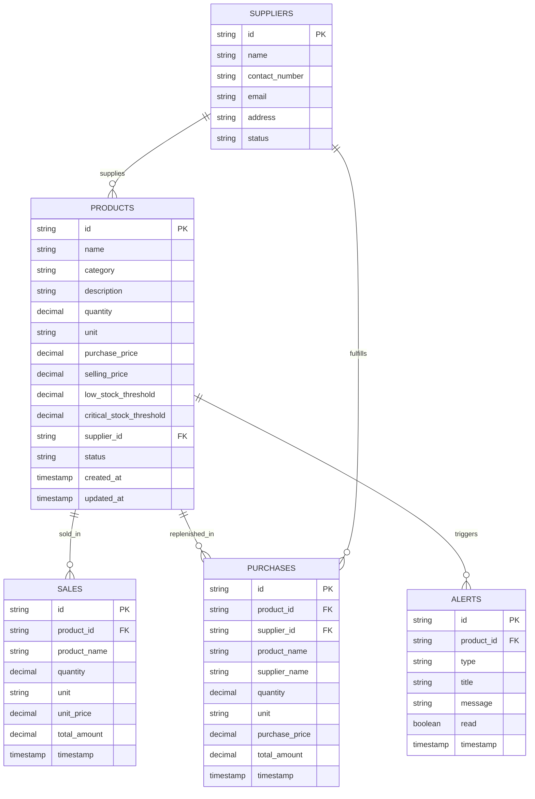

# 🛒 AI SMART SHOP
> **AI-Powered Intelligent Inventory & Shop Assistant**

[](https://github.com/Mahasri9344/AI-Smart-Shop)
[](https://react.dev/)
[](https://www.typescriptlang.org/)
[](https://vitejs.dev/)
[](#-prototype-disclaimer--academic-note)
[](https://github.com/Mahasri9344/AI-Smart-Shop)

**AI Smart Shop** is a modern, commercial-grade intelligent shop management platform built for small and medium retail businesses. It bridges the gap between traditional inventory tracking systems and modern artificial intelligence by combining **proactive critical stock alerts**, **natural-language inventory queries**, **voice command interactions with speech synthesis**, and **real-time dynamic stock intelligence**.

---

## 📌 Problem Statement

Conventional retail shop and inventory management software presents major operational challenges for shopkeepers:
1. **Lack of Proactive Critical Stock Alerts**: Shopkeepers are often unaware when stock reaches critical threshold levels until an item is completely depleted, leading to unfulfilled orders and lost customer revenue.
2. **Complex Multi-Screen Navigation Friction**: Routine shop tasks—such as checking low stock, recording daily sales, or identifying vendor reorder quantities—require navigating through crowded tabular screens and complex menus.
3. **Accessibility & Typing Barriers**: Workers or shopkeepers who are uncomfortable with complex desktop software or quick typing face friction and operational delays during peak business hours.

---

## 🎯 Project Objectives

- **Unified SaaS Dashboard**: Deliver a clean, accessible web dashboard tailored for non-technical retail shop owners.
- **Dynamic Stock Calculation**: Dynamically compute stock status (`NORMAL`, `LOW`, `CRITICAL`) using mathematical threshold evaluations.
- **Proactive Notifications**: Automatically generate urgent alerts when stock crosses critical thresholds, synchronized with top header notification badge counters.
- **Hands-Free AI Voice Assistant**: Enable voice-based inventory queries and audio responses using the Web Speech API (`SpeechRecognition` & `SpeechSynthesis`).
- **Synchronized Sales & Purchases**: Automatically deduct stock on sales entry (with oversell protection guards) and increment stock on purchase order replenishment.
- **Financial & Inventory Analytics**: Calculate inventory valuation, sales revenue, purchase expenses, estimated profit margins, top-selling items, and fast/slow-moving goods velocity.

---

## 💡 Key Features & Modules

### 1. 📊 Smart SaaS Dashboard ([Dashboard.tsx](file:///c:/Users/user/Documents/AI-Smart-Shop/src/pages/Dashboard.tsx))
- **Live KPI Summary**: Real-time metric cards displaying Total Products, Total Stock Units, Inventory Valuation, Low Stock Count, Critical Stock Count, Today's Sales Revenue, and Today's Purchase Costs.
- **Proactive Critical Alert Banner**: Automatically renders prominent warnings when critical stock items are detected in the system.
- **Quick Action Triggers**: Modal launchers for `+ Add Product`, `+ Record Sale`, `+ Record Purchase`, and `🤖 Ask AI`.
- **Activity & Stock Warning Lists**: Quick glance tables showing urgent stock items and recent inventory transactions.

### 2. 📦 Inventory Management ([Inventory.tsx](file:///c:/Users/user/Documents/AI-Smart-Shop/src/pages/Inventory.tsx))
- Real-time catalog management with search, category filtering, and status filtering (`NORMAL`, `LOW`, `CRITICAL`).
- **ProductModal**: Create or update products with custom low stock thresholds, critical stock thresholds, and assigned supplier mappings.
- **StockAdjustModal**: Instant single-click stock quantity adjustments (`+` / `-`).

### 3. 💳 Sales Management ([Sales.tsx](file:///c:/Users/user/Documents/AI-Smart-Shop/src/pages/Sales.tsx))
- **RecordSaleModal**: Log customer billing orders with instant inventory stock deduction.
- **Stock Validation Guard**: Prevents selling greater quantities than currently available in stock.

### 4. 🚚 Purchase Management ([Purchases.tsx](file:///c:/Users/user/Documents/AI-Smart-Shop/src/pages/Purchases.tsx))
- **RecordPurchaseModal**: Record wholesale replenishment orders with automatic stock incrementing.

### 5. 🤝 Supplier Directory ([Suppliers.tsx](file:///c:/Users/user/Documents/AI-Smart-Shop/src/pages/Suppliers.tsx))
- **SupplierModal**: Manage wholesale vendors, phone numbers, email addresses, physical locations, and mapped product catalogs.

### 6. 🤖 AI Smart Assistant & Voice Interface ([AIAssistant.tsx](file:///c:/Users/user/Documents/AI-Smart-Shop/src/pages/AIAssistant.tsx))
- **Web Speech API Integration**: Real-time microphone voice input (`SpeechRecognition`) and natural spoken audio response synthesis (`SpeechSynthesis`).
- **Natural-Language NLP Engine** ([aiService.ts](file:///c:/Users/user/Documents/AI-Smart-Shop/src/services/aiService.ts)): Answers dynamic shop questions without hardcoded responses, such as:
  - *"Which products are critical?"*
  - *"What should I restock?"*
  - *"Show today's sales"*
  - *"How many almonds are available?"*

### 7. 🚨 Proactive Alerts & Notification Center ([Alerts.tsx](file:///c:/Users/user/Documents/AI-Smart-Shop/src/pages/Alerts.tsx))
- Centralized alert logs for critical and low stock events, synchronized with top header badge notification counters. Mark notifications as read or dismiss them with a single click.

### 8. 📈 Analytics & Financial Intelligence ([Analytics.tsx](file:///c:/Users/user/Documents/AI-Smart-Shop/src/pages/Analytics.tsx))
- **Financial Overview**: Inventory Valuation, Gross Sales Revenue, Purchase Costs, and Estimated Profit Margins (`Revenue - Purchase Costs`).
- **Inventory Velocity**: Categorizes products into fast-moving vs. slow-moving stock based on sales transaction volume.
- **Top-Selling Ranking**: Ranked lists of best-performing store items by revenue.
- **Category Valuation Breakdown**: Relative visual distribution bars across categories.

### 9. 🎨 Responsive SaaS UI & Design System ([index.css](file:///c:/Users/user/Documents/AI-Smart-Shop/src/index.css))
- **Vanilla CSS Design Tokens**: Custom HSL color variables, dark/light theme tokens, subtle glassmorphism cards, and smooth CSS transitions.
- **Responsive Layout**: Sidebar drawer navigation, header search bar, critical stock indicator badges, and mobile-friendly layouts.

### 10. 🔐 User Authentication & Settings ([Login.tsx](file:///c:/Users/user/Documents/AI-Smart-Shop/src/pages/Login.tsx), [Settings.tsx](file:///c:/Users/user/Documents/AI-Smart-Shop/src/pages/Settings.tsx))
- User authentication screens (Login & Signup), profile configuration, theme toggle controls, and notification preferences.

---

## 🏗️ System Architecture Diagram

```
                               ┌────────────────────────────────────────┐
                               │           UI / View Layer              │
                               │ React 19 Components, SaaS Shell        │
                               └───────────────────┬────────────────────┘
                                                   │
                ┌──────────────────────────────────┼──────────────────────────────────┐
                │                                  │                                  │
    ┌───────────▼───────────┐          ┌───────────▼───────────┐          ┌───────────▼───────────┐
    │     AI Engine         │          │    Data & Stock Service│          │     Voice Engine      │
    │ - Intent Recognizer   │◄─────────┤ - Realtime Inventory  │─────────►│ - Speech Recognition  │
    │ - Dynamic Query Engine│          │ - Dynamic Stock Status│          │ - Text-to-Speech (TTS)│
    │ - Natural Answers     │          │ - Sales & Purchases   │          │ - Speech State Sync   │
    └───────────────────────┘          └───────────┬───────────┘          └───────────────────────┘
                                                   │
                                       ┌───────────▼───────────┐
                                       │ Storage / Persistence │
                                       │ LocalStorage Store /  │
                                       │ DataService Adapter   │
                                       └───────────────────────┘
```

---

## 🔄 Data Flow Diagram

```
[User Action / Voice Command / Sales Entry]
                │
                ▼
      ┌──────────────────┐
      │  React View / UI │
      └─────────┬────────┘
                │
                ▼
      ┌──────────────────┐      ┌───────────────────────────┐
      │   ShopContext    ├─────►│ stockIntelligence Engine  │
      └─────────┬────────┘      │ - Calculate NORMAL / LOW /│
                │               │   CRITICAL Stock Status   │
                │               └─────────────┬─────────────┘
                │                             │
                ▼                             ▼
      ┌──────────────────┐      ┌───────────────────────────┐
      │   DataService    │      │  Proactive Alert Trigger  │
      │  (LocalStorage)  │      │ - Create NotificationItem │
      └──────────────────┘      └───────────────────────────┘
```

---

## 📐 Dynamic Stock Calculation Formula

Stock status is dynamically evaluated per item using mathematical threshold boundaries:

$$\text{Status} = \begin{cases} \text{CRITICAL} & \text{if } \text{quantity} \le \text{criticalStockThreshold} \\ \text{LOW} & \text{if } \text{criticalStockThreshold} < \text{quantity} \le \text{lowStockThreshold} \\ \text{NORMAL} & \text{if } \text{quantity} > \text{lowStockThreshold} \end{cases}$$

---

## 🛠️ Technology Stack

| Layer | Technology | Details |
| :--- | :--- | :--- |
| **Frontend Framework** | React 19.0 + TypeScript 6.0 | Modern declarative component architecture |
| **Build Tool & Server** | Vite 8.3 | Lightning-fast HMR and production bundle optimization |
| **Routing** | React Router v7.18 | Single-page application nested layout routing |
| **Styling & UI** | Vanilla CSS3 | Custom HSL design tokens, CSS Flexbox/Grid, Glassmorphism |
| **Iconography** | Lucide React | Clean commercial icon set |
| **State & Persistence** | React `ShopContext` + `DataService` | Reactive state provider with `LocalStorage` seed persistence |
| **Voice & Audio** | Web Speech API | Native browser `SpeechRecognition` & `SpeechSynthesis` |
| **Linting & Quality** | Oxlint 1.81 | High-performance code quality linter |

---

## 🗄️ Current Data Model & Type System

The current frontend application models retail shop operations using strict TypeScript interfaces ([`src/types/index.ts`](file:///c:/Users/user/Documents/AI-Smart-Shop/src/types/index.ts)):

### 1. `Product` Interface
Represents store inventory items with dynamic status calculation boundaries and supplier linkage:
- `id` (`string`): Unique product identifier (e.g. `'prod-1'`).
- `name` (`string`): Display product name (e.g. `'California Almonds'`).
- `category` (`ProductCategory`): Enum value (`'Dry Fruits'`, `'Spices'`, `'Groceries'`, `'Natural Sugars'`, `'Beverages'`, `'Other'`).
- `description` (`string`): Detailed description of the store item.
- `quantity` (`number`): Current available physical stock count.
- `unit` (`UnitType`): Measurement unit (`'kg'`, `'g'`, `'L'`, `'ml'`, `'units'`, `'packets'`, `'boxes'`).
- `purchasePrice` (`number`): Wholesale unit cost paid to supplier (₹).
- `sellingPrice` (`number`): Retail unit price charged to customers (₹).
- `lowStockThreshold` (`number`): Quantity threshold triggering `'LOW'` status.
- `criticalStockThreshold` (`number`): Quantity threshold triggering `'CRITICAL'` status.
- `supplierId` (`string`): Foreign key mapping to assigned `Supplier`.
- `supplierName` (`string`): Denormalized display name of supplier.
- `status` (`StockStatus`): Dynamic status (`'NORMAL'`, `'LOW'`, `'CRITICAL'`).
- `createdAt` / `updatedAt` (`string`): ISO 8601 timestamps.

### 2. `Sale` Interface
Represents customer sales billing transactions:
- `id` (`string`): Unique transaction ID (`'sale-...'`).
- `productId` (`string`): Mapped `Product` ID.
- `productName` (`string`): Product display name at time of sale.
- `quantity` (`number`): Quantity sold to customer.
- `unit` (`UnitType`): Unit of measurement.
- `unitPrice` (`number`): Selling price per unit (₹).
- `totalAmount` (`number`): Total billing amount (`quantity * unitPrice`).
- `timestamp` (`string`): ISO 8601 transaction date and time.

### 3. `Purchase` Interface
Represents wholesale stock replenishment orders:
- `id` (`string`): Unique purchase order ID (`'purch-...'`).
- `productId` (`string`): Mapped `Product` ID.
- `productName` (`string`): Product display name.
- `supplierId` (`string`): Supplier ID.
- `supplierName` (`string`): Vendor display name.
- `quantity` (`number`): Restocked quantity.
- `unit` (`UnitType`): Unit of measurement.
- `purchasePrice` (`number`): Wholesale unit cost (₹).
- `totalAmount` (`number`): Total replenishment expense (`quantity * purchasePrice`).
- `timestamp` (`string`): ISO 8601 purchase order timestamp.

### 4. `Supplier` Interface
Represents wholesale vendor directory details:
- `id` (`string`): Unique supplier ID (`'sup-...'`).
- `name` (`string`): Vendor or agency name.
- `contactNumber` (`string`): Primary phone contact.
- `email` (`string`): Vendor email address.
- `address` (`string`): Physical office or warehouse location.
- `productsSupplied` (`string[]`): Array of product category/item names supplied.
- `totalPurchases` (`number`): Aggregate purchase volume.
- `lastPurchaseDate` (`string`): Date of most recent purchase order.
- `status` (`'ACTIVE' | 'INACTIVE'`): Operational status.

### 5. `NotificationItem` Interface
Represents proactive system alerts:
- `id` (`string`): Unique alert ID (`'notif-...'`).
- `type`: Enum (`'CRITICAL_STOCK'`, `'LOW_STOCK'`, `'STOCK_UPDATED'`, `'SALE_RECORDED'`, `'PURCHASE_RECORDED'`, `'AI_RECOMMENDATION'`).
- `title` (`string`): Short warning header.
- `message` (`string`): Detailed notification text with current stock metrics.
- `timestamp` (`string`): Alert creation time.
- `read` (`boolean`): Read/unread flag.
- `productId` (`string?`): Optional associated product ID for quick action triggering.

### 6. `UserProfile` Interface
Represents shopkeeper profile and shop branding metadata (`id`, `name`, `email`, `shopName`, `phone`, `address`, `role`).

---

## 💾 Current Data Storage Architecture

> [!NOTE]
> **Frontend / LocalStorage Implementation**: The current version of AI SMART SHOP is a client-side frontend web prototype. All application state is stored locally using browser `LocalStorage` and managed in memory by `DataService` ([`src/services/dataService.ts`](file:///c:/Users/user/Documents/AI-Smart-Shop/src/services/dataService.ts)) and React `ShopContext` ([`src/context/ShopContext.tsx`](file:///c:/Users/user/Documents/AI-Smart-Shop/src/context/ShopContext.tsx)). Persistent backend cloud server & database integration is planned as future production work.

### Storage Keys Used
- `ai_smart_shop_products_v1`: Product catalog array with auto-seeding.
- `ai_smart_shop_sales_v1`: Customer sales transaction logs.
- `ai_smart_shop_purchases_v1`: Wholesale purchase orders.
- `ai_smart_shop_suppliers_v1`: Supplier directory records.
- `ai_smart_shop_notifications_v1`: System alert logs.
- `ai_smart_shop_profile_v1`: User profile & shop branding metadata.

---

## 🔄 Current Application Data Flow

```
┌─────────────────────────────────────────────────────────────────────────────────┐
│                              User Interface (UI Layer)                          │
│     (Pages: Dashboard, Inventory, Sales, Purchases, Alerts, AIAssistant)        │
└────────────────────────────────────────┬────────────────────────────────────────┘
                                         │
                                         ▼
┌─────────────────────────────────────────────────────────────────────────────────┐
│                            React ShopContext State                              │
│       - Reactive state (`products`, `sales`, `purchases`, `notifications`)      │
│       - Transaction Handlers (`recordSale`, `recordPurchase`, `adjustStock`)    │
└──────────────┬─────────────────────────┬──────────────────────────┬─────────────┘
               │                         │                          │
               ▼                         ▼                          ▼
┌─────────────────────────────┐ ┌──────────────────┐ ┌─────────────────────────────┐
│ stockIntelligence Service   │ │   AIService      │ │    voiceService             │
│ - Threshold evaluation      │ │ - Intent Parsing │ │ - Web Speech Recognition    │
│ - Alert Deduplication       │ │ - NLP Answers    │ │ - Text-to-Speech (TTS)      │
└──────────────┬──────────────┘ └──────────────────┘ └─────────────────────────────┘
               │
               ▼
┌─────────────────────────────────────────────────────────────────────────────────┐
│                     DataService Persistence Adapter                             │
│     - Synchronizes state mutations to Browser LocalStorage                      │
│     - Fallback initialization with pre-seeded sample retail dataset             │
└─────────────────────────────────────────────────────────────────────────────────┘
```

---

## ⚙️ Current Service Layer Responsibilities

1. **`DataService` ([`src/services/dataService.ts`](file:///c:/Users/user/Documents/AI-Smart-Shop/src/services/dataService.ts))**:
   Client-side data persistence adapter. Loads, saves, and resets catalog items, sales, purchases, suppliers, and notifications from `LocalStorage` with safe `try...catch` fallback defaults.

2. **`stockIntelligence` ([`src/services/stockIntelligence.ts`](file:///c:/Users/user/Documents/AI-Smart-Shop/src/services/stockIntelligence.ts))**:
   Core mathematical stock evaluation engine. Calculates status boundaries (`CRITICAL`, `LOW`, `NORMAL`), updates product status timestamps, and computes financial summary metrics.

3. **`AIService` ([`src/services/aiService.ts`](file:///c:/Users/user/Documents/AI-Smart-Shop/src/services/aiService.ts))**:
   Rule-based natural language intent parser. Processes user text queries and generates intelligent responses for critical stock warnings, restock recommendations, daily sales totals, and product quantity lookups.

4. **`voiceService` ([`src/services/voiceService.ts`](file:///c:/Users/user/Documents/AI-Smart-Shop/src/services/voiceService.ts))**:
   Web Speech API adapter. Handles microphone speech-to-text recognition (`SpeechRecognition`) and audio speech synthesis (`SpeechSynthesis`) for hands-free assistant interaction.

---

## 🌐 Planned Future REST API Design

> [!IMPORTANT]
> **Planned / Future Backend Specification**: The following REST API endpoint specification is a proposed architectural design for future cloud backend implementation (Node.js/Express or Python/FastAPI backend with database persistence). These endpoints are **NOT** currently implemented in the frontend prototype.

| HTTP Method | Endpoint Path | Description | Planned Payload / Query |
| :--- | :--- | :--- | :--- |
| `GET` | `/api/products` | Fetch all products with filter options | `?category=Dry+Fruits&status=CRITICAL` |
| `POST` | `/api/products` | Create a new inventory product | `Product` object body |
| `PUT` | `/api/products/:id` | Update product details or stock thresholds | Partial `Product` body |
| `DELETE` | `/api/products/:id` | Delete product from catalog | N/A |
| `PATCH` | `/api/products/:id/stock` | Adjust stock quantity directly | `{ deltaQuantity: number }` |
| `GET` | `/api/sales` | Fetch sales transaction history | `?startDate=2026-09-01&endDate=...` |
| `POST` | `/api/sales` | Record new customer sale (deducts stock) | `{ productId, quantity, unitPrice }` |
| `GET` | `/api/purchases` | Fetch wholesale purchase order history | `?supplierId=sup-1` |
| `POST` | `/api/purchases` | Record purchase replenishment (increments stock) | `{ productId, supplierId, quantity, purchasePrice }` |
| `GET` | `/api/suppliers` | List all wholesale suppliers | `?status=ACTIVE` |
| `POST` | `/api/suppliers` | Add new vendor contact | `Supplier` object body |
| `PUT` | `/api/suppliers/:id` | Update supplier details | Partial `Supplier` body |
| `GET` | `/api/alerts` | Fetch active notifications & stock alerts | `?unreadOnly=true` |
| `PUT` | `/api/alerts/:id/read` | Mark alert notification as read | N/A |
| `POST` | `/api/ai/query` | Process AI assistant natural language query | `{ query: string }` |

---

## 🗄️ Planned Future Database Schema

> [!IMPORTANT]
> **Planned / Future Database Specification**: The schema below represents the planned relational database design (PostgreSQL/MySQL or Cloud Firestore) for post-prototype cloud integration. It is **NOT** currently active.



### High-Level Relational Model
- **`suppliers` ──< `products`**: One supplier can supply multiple catalog products (`products.supplier_id` → `suppliers.id`).
- **`products` ──< `sales`**: One product can have many customer sales records (`sales.product_id` → `products.id`).
- **`products` ──< `purchases`**: One product can have multiple wholesale replenishment purchase orders (`purchases.product_id` → `products.id`).
- **`suppliers` ──< `purchases`**: Each purchase order maps to the fulfilling vendor (`purchases.supplier_id` → `suppliers.id`).
- **`products` ──< `alerts`**: Stock depletion events generate linked notification records (`alerts.product_id` → `products.id`).

---

## 📂 Project Structure & 16 Major Modules Map

The codebase is organized into 16 clearly identifiable, modular components for seamless developer inspection:

| # | Major Module | Description & Implementation Files |
| :--- | :--- | :--- |
| **1** | **Dashboard** | SaaS KPI overview, critical alert banner, quick actions → [`src/pages/Dashboard.tsx`](file:///c:/Users/user/Documents/AI-Smart-Shop/src/pages/Dashboard.tsx) |
| **2** | **Inventory** | Catalog table, stock thresholds, CRUD & quick adjust → [`src/pages/Inventory.tsx`](file:///c:/Users/user/Documents/AI-Smart-Shop/src/pages/Inventory.tsx), [`src/components/inventory/`](file:///c:/Users/user/Documents/AI-Smart-Shop/src/components/inventory/) |
| **3** | **Sales** | Billing order recording with stock validation guards → [`src/pages/Sales.tsx`](file:///c:/Users/user/Documents/AI-Smart-Shop/src/pages/Sales.tsx), [`src/components/sales/`](file:///c:/Users/user/Documents/AI-Smart-Shop/src/components/sales/) |
| **4** | **Purchases** | Wholesale replenishment orders & auto-stock increment → [`src/pages/Purchases.tsx`](file:///c:/Users/user/Documents/AI-Smart-Shop/src/pages/Purchases.tsx), [`src/components/purchases/`](file:///c:/Users/user/Documents/AI-Smart-Shop/src/components/purchases/) |
| **5** | **Suppliers** | Vendor contacts, address directory & catalog mapping → [`src/pages/Suppliers.tsx`](file:///c:/Users/user/Documents/AI-Smart-Shop/src/pages/Suppliers.tsx), [`src/components/suppliers/`](file:///c:/Users/user/Documents/AI-Smart-Shop/src/components/suppliers/) |
| **6** | **Analytics** | Profit margins, top-selling items & inventory velocity → [`src/pages/Analytics.tsx`](file:///c:/Users/user/Documents/AI-Smart-Shop/src/pages/Analytics.tsx) |
| **7** | **Alerts / Notifications** | Proactive stock warnings & Smart Reorder triggers → [`src/pages/Alerts.tsx`](file:///c:/Users/user/Documents/AI-Smart-Shop/src/pages/Alerts.tsx) |
| **8** | **AI Assistant** | Natural-language query processor engine → [`src/pages/AIAssistant.tsx`](file:///c:/Users/user/Documents/AI-Smart-Shop/src/pages/AIAssistant.tsx), [`src/services/aiService.ts`](file:///c:/Users/user/Documents/AI-Smart-Shop/src/services/aiService.ts) |
| **9** | **Voice Recognition / TTS** | Web Speech API (`SpeechRecognition` & `SpeechSynthesis`) → [`src/services/voiceService.ts`](file:///c:/Users/user/Documents/AI-Smart-Shop/src/services/voiceService.ts) |
| **10** | **Reusable UI Components** | Header, Sidebar, StatCards, Badges, Modals → [`src/components/common/`](file:///c:/Users/user/Documents/AI-Smart-Shop/src/components/common/) |
| **11** | **Services / Application Logic** | Business logic & data adapters → [`src/services/`](file:///c:/Users/user/Documents/AI-Smart-Shop/src/services/) |
| **12** | **Context / State** | Central reactive `ShopContext` provider → [`src/context/ShopContext.tsx`](file:///c:/Users/user/Documents/AI-Smart-Shop/src/context/ShopContext.tsx) |
| **13** | **Data / Seed Storage** | Seed data adapter (21 products across 6 categories) → [`src/data/sampleData.ts`](file:///c:/Users/user/Documents/AI-Smart-Shop/src/data/sampleData.ts) |
| **14** | **Types / Interfaces** | TypeScript contracts & type definitions → [`src/types/index.ts`](file:///c:/Users/user/Documents/AI-Smart-Shop/src/types/index.ts) |
| **15** | **Layouts** | Main SaaS shell layout frame → [`src/layouts/MainLayout.tsx`](file:///c:/Users/user/Documents/AI-Smart-Shop/src/layouts/MainLayout.tsx) |
| **16** | **CSS / Styling** | Design system tokens, Light Mode UI & layout styling → [`src/index.css`](file:///c:/Users/user/Documents/AI-Smart-Shop/src/index.css), [`src/App.css`](file:///c:/Users/user/Documents/AI-Smart-Shop/src/App.css) |

```
AI-Smart-Shop/
├── public/              # Favicon and static branding assets
├── src/
│   ├── assets/          # SVG branding assets
│   ├── components/      # Reusable UI component library (common, inventory, sales, purchases, suppliers)
│   ├── context/         # Central reactive state provider & hooks
│   ├── data/            # Pre-seeded dataset (21 retail products across 6 categories)
│   ├── layouts/         # MainLayout SaaS shell frame
│   ├── pages/           # Module views (Dashboard, Inventory, Sales, Purchases, Suppliers, AIAssistant, Alerts, Analytics, etc.)
│   ├── services/        # DataService, StockIntelligence, AIService, VoiceService
│   ├── types/           # TypeScript interfaces & contracts
│   ├── App.tsx          # Main application router
│   ├── main.tsx         # Application entry point
│   └── index.css        # Global CSS design system & Light Mode UI tokens
├── vercel.json          # Vercel deployment & SPA rewrite config
├── package.json         # Dependencies and scripts
└── README.md            # Project documentation
```

---

## 💻 Setup & Local Installation

### Prerequisites
- **Node.js**: v18.0.0 or higher
- **npm**: v9.0.0 or higher

### Installation Steps

1. **Clone the repository**:
   ```bash
   git clone https://github.com/Mahasri9344/AI-Smart-Shop.git
   cd AI-Smart-Shop
   ```

2. **Install dependencies**:
   ```bash
   npm install
   ```

3. **Start local development server**:
   ```bash
   npm run dev
   ```
   Open your web browser and navigate to `http://localhost:5173`.

4. **Build for production**:
   ```bash
   cmd /c "npm run build"
   ```

5. **Preview production build**:
   ```bash
   npm run preview
   ```

---

## 🧪 Testing

The project includes automated unit testing for core retail business logic built with **Vitest**:

### Framework Used
- **Testing Framework**: [Vitest](https://vitest.dev/) (Lightweight, fast test runner natively integrated with Vite & TypeScript)

### How to Run Tests
```bash
npm test
```

### Important Business Logic Covered
- **Stock Intelligence (`stockIntelligence.test.ts`)**:
  - `calculateStockStatus`: Tests zero stock, critical threshold boundaries, low stock threshold boundaries, and normal stock.
  - `updateProductStockStatus`: Validates dynamic recalculation of product stock status and timestamp updates.
- **Inventory & Transaction Rules (`ShopContext.test.ts`)**:
  - **Oversell Guard**: Verifies that sales exceeding available inventory stock are rejected with an insufficient stock error message.
  - **Valid Sales Execution**: Verifies correct inventory stock deduction and revenue calculations (`quantity * sellingPrice`).
  - **Purchase Replenishment**: Verifies stock increments upon wholesale order recording and purchase cost calculations (`quantity * purchasePrice`).
  - **Alert Detection**: Verifies automatic alert notification generation when stock drops below thresholds.
- **AI Assistant Intent Engine (`aiService.test.ts`)**:
  - Tests natural-language intent recognition for critical stock warnings, restock recommendations, revenue inquiries, and product quantity lookups.
- **Data Persistence Adapter (`dataService.test.ts`)**:
  - Tests LocalStorage fallback behavior and sample data dataset resets.

---

## 🛡️ Error Handling

The application implements a robust **React Error Boundary** pattern ([`ErrorBoundary.tsx`](file:///c:/Users/user/Documents/AI-Smart-Shop/src/components/common/ErrorBoundary.tsx)) to ensure application resilience and prevent full web page crashes during unexpected runtime rendering errors:

### Architecture & Placement
- **Top-Level Application Guard ([`App.tsx`](file:///c:/Users/user/Documents/AI-Smart-Shop/src/App.tsx))**: Wraps the entire application (`ShopProvider` & `BrowserRouter`) to catch unhandled errors anywhere in the root context or routing tree.
- **Layout Content Guard ([`MainLayout.tsx`](file:///c:/Users/user/Documents/AI-Smart-Shop/src/layouts/MainLayout.tsx))**: Wraps the main nested content area (`<Outlet />`). If an error occurs in an individual page component (e.g. Dashboard, Inventory, Sales), the top header bar and sidebar navigation remain functional while the error boundary renders a fallback UI inside the main content viewport.

### Fallback Behavior
- **Professional Fallback UI**: When an unhandled React error is caught, the Error Boundary suppresses white screen crashes and renders a clean, themed error card.
- **User Actions**: Provides **"Try Again"** (resets error state to attempt re-rendering) and **"Go to Home"** (redirects to home dashboard).
- **Console Diagnostics**: Automatically captures and logs error details and component stack traces (`componentDidCatch`) for developer diagnostics.

---

## 📊 Verification & Build Status

The application has undergone thorough compilation and verification testing:

- **Build Status**: **PASSING** (0 errors)
- **TypeScript Checking**: Passed cleanly with `tsc -b`
- **Vite Bundle Build**: Successfully generated production bundle in `dist/`
- **Linting**: Verified with Oxlint

```bash
> ai-smart-shop@0.0.0 build
> tsc -b && vite build

vite v8.3.0 building client environment for production...
✓ 1901 modules transformed.
rendering chunks...
dist/index.html                   0.46 kB │ gzip:   0.29 kB
dist/assets/index-C3Amy-l8.css    9.02 kB │ gzip:   2.44 kB
dist/assets/index-BHVvUKHJ.js   377.42 kB │ gzip: 106.60 kB
✓ built in 973ms
```

---

## 🔗 GitHub Repository Information

- **Repository**: [https://github.com/Mahasri9344/AI-Smart-Shop](https://github.com/Mahasri9344/AI-Smart-Shop)
- **Main Branch**: `main`

---

## ⚠️ Prototype Disclaimer & Academic Note

> [!NOTE]
> **AI Smart Shop** is currently a **commercial-grade frontend prototype** developed for academic evaluation (Review-1). The application operates with reactive local state and `LocalStorage` persistence to demonstrate complete user workflows, AI dynamic querying, and voice interactions without requiring external backend server setup.

---

## 🔮 Future Enhancements Roadmap

The following enhancements are identified for post-prototype cloud deployment:

1. **☁️ Firebase / Cloud Backend Integration**: Replace client-side `LocalStorage` with Firestore database synchronization and Firebase Authentication for multi-tenant users.
2. **📲 Automated Supplier WhatsApp & SMS Dispatch**: Integrate WhatsApp Business API / Twilio webhooks to automatically send purchase order restock messages to vendors when stock hits `CRITICAL` levels.
3. **🤖 ML Predictive Demand Forecasting**: Add AI sales velocity models to calculate stock depletion dates (e.g., *"Stock will deplete in 4 days based on weekly sales speed"*).
4. **🗣️ Multi-Language Voice Recognition**: Extend Web Speech recognition to regional languages (Hindi, Tamil, Telugu, Spanish, etc.) for non-English retail workers.
5. **📷 Barcode & QR Code Scanning**: Integrate camera-based barcode scanning for rapid billing at POS counter and stock check-in.
6. **📄 PDF & Excel Financial Reports**: Add export capabilities for financial tax summaries, daily sales logs, and inventory valuation sheets.

---

## 📄 License

Developed for **AI SMART SHOP** project evaluation. All rights reserved.

---

## 📸 Project Screenshots

### 🏠 Dashboard


### 📦 Inventory Management


### 💰 Sales Management


### 🛒 Purchase Management


### 👥 Supplier Management


### 📊 Analytics


### 🔔 Alerts & Notifications


### 🤖 AI Assistant & Voice Interaction


### ➕ Add Product

